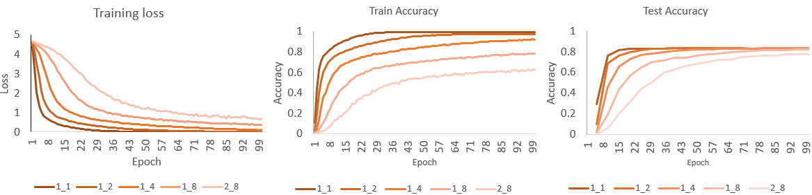
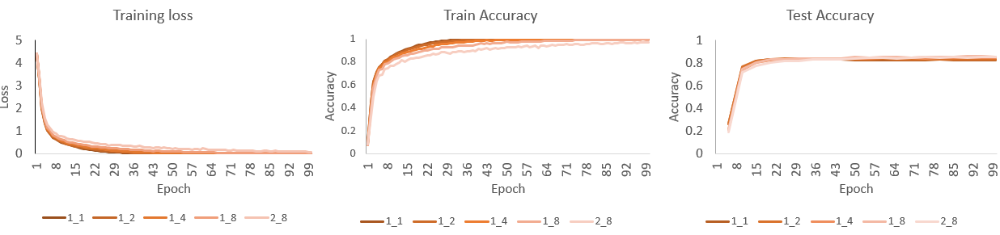
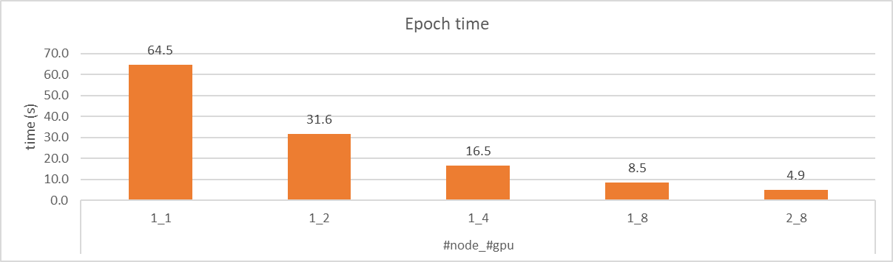

# Distributed Data Parallel training on AMD GPU with ROCm

With the increase in complexity and size of machine learning models, the demand for computational resources grows. Training on a single GPU can become a bottleneck for deep learning applications, especially with large datasets and models that are slow to train on a single GPU. Parallelized training addresses this challenge. Out of the various forms of parallelized training, this blog focuses on [Distributed Data Parallel](https://pytorch.org/tutorials/intermediate/ddp_tutorial.html) (DDP), a key feature in PyTorch that accelerates training across multiple GPUs and nodes.

This blog demonstrates how to speed up the training of a [ResNet](https://arxiv.org/abs/1512.03385) model on the [`CIFAR-100`](https://www.cs.toronto.edu/~kriz/cifar.html) classification task using PyTorch DDP on AMD GPUs with ROCm.

## Distributed Data Parallel

(DDP) enables model training across multiple GPUs or nodes by implementing data parallelism at the module level. In DDP training, multiple processes are spawned, each hosting a single DDP instance, with every process owning a replica of the model. During the forward pass, each process handles a distinct batch of data in parallel by passing inputs to its local model.

During the backward pass, the `backward()` function is called on the loss tensor within each process, which computes gradients for the model parameters. DDP organizes parameter gradients into buckets. The number of parameter gradients assigned to a bucket can be configured. When the parameter gradients in a bucket are ready, DDP triggers an asynchronous `allreduce` operation on the bucket, which calculates mean of gradients across all processes. This step is asynchronous, which implies that the `allreduce` process can overlap with the parameters gradients computations assigned to other buckets. This improves the training efficiency. After completing the `allreduce` operations on all the buckets, the averaged gradients are written to the `param.grad` field of the model's parameters on each process.

Each process maintains an optimizer that performs a full optimization step during each iteration. The optimizer updates the local model using the synchronized gradients, ensuring that all model replicas remain consistent across processes. Since each process begins with the same model and optimizer state, and shares the same averaged gradients after each iteration, the updates remain identical across all processes. For more details, see [Pytorch Distributed Data Parallel Overview](https://pytorch.org/tutorials/intermediate/ddp_tutorial.html) and [Pytorch Distributed Data Parallel Design](https://pytorch.org/docs/main/notes/ddp.html).

## Setup

This blog was created using the following setup. For comprehensive support details about the setup, please refer to the [ROCm installation](https://rocm.docs.amd.com/projects/install-on-linux/en/latest/).

* Hardware & OS:
  * [AMD Instinct GPU](https://www.amd.com/en/products/accelerators/instinct.html)
  * Ubuntu 22.04.3 LTS
* Software:
  * [ROCm 6.1 or later](https://rocm.docs.amd.com/projects/install-on-linux/en/develop/how-to/amdgpu-install.html)
  * [PyTorch 2.1 or later for ROCm](https://rocm.docs.amd.com/projects/install-on-linux/en/latest/how-to/3rd-party/pytorch-install.html)
  
This blog utilizes the [`rocm/pytorch:rocm6.2_ubuntu20.04_py3.9_pytorch_release_2.1.2`](https://hub.docker.com/layers/rocm/pytorch/rocm6.2_ubuntu20.04_py3.9_pytorch_release_2.1.2/images/sha256-58186da550e3d83c5b598ce0c1f581206eabd82c85bd77d22b34f5695d749762?context=explore) Docker image on two nodes with each node equipped with eight MI300x GPUs.

## Getting started

In the following sections, the code related to DDP application is highlighted. For complete source code, see [rocm-blogs Github repo](https://github.com/ROCm/rocm-blogs/tree/release/blogs/artificial-intelligence/ddp-training).

> Note:
    If you are only interested in running the training and checking the results, jump to the [Multi-GPU and multi-node training](#multi-gpu-and-multi-node-training) section.

Here are the steps to get started on DDP training:

* Import the necessary packages.

    ```python
    import torch
    import torch.optim as optim
    from torch.utils.data.distributed import DistributedSampler
    from torch.utils.data import DataLoader

    import torchvision
    import torchvision.transforms as transforms

    import torch.distributed as dist

    import time
    import os
    ```

    The `torch.distributed` package provides support and communication primitives for multiprocess parallelism across multiple computation nodes on a single machine or across several machines. The `torch.nn.parallel.DistributedDataParallel()` class builds on this functionality, providing synchronous distributed training by wrapping any PyTorch model. To use `DDP` with a PyTorch model, the first step is to initialize the default distributed process group and the distributed package.

    ```python
    # nccl is recommended by pytorch for distributed GPU training
    dist.init_process_group(backend="nccl") 
    ```

    The `rank` and  `world_size` are not passed to `init_process_group()`. In this blog we use ['torchrun'](https://pytorch.org/docs/stable/elastic/run.html) to launch the training script, which automatically sets these environment variables based on the number of processes and nodes. This is further discussed in the [Multi-GPU and multi-node training] (#multi-gpu-and-multi-node-training)section.

* To check the process id along with the local and global ranks, use the following command. Generally, each process is assigned to a specific GPU.

    ```python
    global_rank = int(os.environ["RANK"])
    local_rank = int(os.environ["LOCAL_RANK"])
    print(f"Hello from local_rank {local_rank}, global_rank {global_rank}")
    ```

* To use `DDP` on a host with N GPUs, N processes should be spawned, with each process assigned to a specific GPU, ranging from 0 to N-1. This can be achieved by calling:

    ```python
    torch.cuda.set_device(local_rank)
    ```

* Create the Resnet101 model and wrap it with `torch.nn.parallel.DistributedDataParallel()` for DDP training.

    ```python
    model = torchvision.models.resnet101(weights='IMAGENET1K_V1')
    #change the output since we are using CIFAR100
    model.fc = torch.nn.Linear(model.fc.in_features, 100)

    model = model.to(local_rank)
    ddp_model = torch.nn.parallel.DistributedDataParallel(model, device_ids=[local_rank], output_device=local_rank)
    ```

* Prepare dataset and dataloader

    In this section we will prepare dataset and dataloader for training. the In DDP, each process can pass a `DistributedSampler` instance as a DataLoader sampler. The DistributedSampler ensures that each device gets a non-overlapping input batch for training.

    ```python
    transform = transforms.Compose([
        transforms.Resize((224, 224)),
        transforms.RandomHorizontalFlip(),
        transforms.ToTensor(),
        transforms.Normalize((0.5, 0.5, 0.5), (0.5, 0.5, 0.5)),
    ])

    train_dataset = torchvision.datasets.CIFAR100(root="./data", train=True, download=False, transform=transform) 
    test_dataset = torchvision.datasets.CIFAR100(root="./data", train=False, download=False, transform=transform)

    # Restricts data loading to a subset of the dataset exclusive to the current process
    train_loader = DataLoader(dataset=train_dataset, batch_size=batch_size, sampler=DistributedSampler(dataset=train_dataset), shuffle=False, num_workers=16)

    # Testing only on rank 0
    test_loader = DataLoader(dataset=test_dataset, batch_size=batch_size, shuffle=False, num_workers=16)
    ```

* Prepare loss function and optimizer.

    ```python
    criterion = torch.nn.CrossEntropyLoss()
    optimizer = optim.SGD(ddp_model.parameters(), lr=learning_rate, momentum=0.9)
    ```

* Define helper functions to evaluate the model on test dataset during training.

    ```python
    def evaluate_on_test_data(model, device, test_loader):
        model.eval()
        correct_num = 0
        total = 0
        with torch.no_grad():
            for data in test_loader:
                images, labels = data[0].to(device), data[1].to(device)
                outputs = model(images)
                predicted = outputs.argmax(dim=1)
                total += len(labels)
                correct_num += (predicted == labels).sum().item()

        return correct_num / total
    ```

* Define helper functions to train one epoch.

    ```python
    # function used to train one epoch
    def train_epoch(model, dataloader, criterion, optimizer, device, bs):  # bs: bach size
        model.train()  
        total_loss = 0  
        total_correct = 0  

        for batch in dataloader:
            images, labels = batch[0].to(device), batch[1].to(device)
            
            optimizer.zero_grad() # reset gradients 
            outputs = model(images)
            loss = criterion(outputs, labels)
            loss.backward()
            optimizer.step()
            
            total_loss += loss.item()
            predictions = outputs.argmax(dim=1)

            correct_num = (predictions == labels).sum().item()
            total_correct += correct_num

        return total_loss / len(dataloader), total_correct / (len(dataloader)*bs)

    ```

* After wrapping the original model with `torch.nn.parallel.DistributedDataParallel()`, the `ddp_model` can be used like any other model in the training loop, without requiring any changes. The key point to remember is that each process or GPU runs the training loop in parallel, with its own replica of the model and optimizer.

    ```python
    log_epoch = 0
    # Training Loop
    training_start = time.perf_counter()
    for epoch in range(num_epochs):
        log_epoch += 1
        epoch_start_time = time.perf_counter()

        ddp_model.train()
        # In distributed mode, calling the set_epoch() method at the beginning of each epoch 
        # is necessary to make shuffling work properly across multiple epochs. 
        # Otherwise, the same ordering will be always used.
        train_loader.sampler.set_epoch(epoch)
        train_loss, train_acc = train_epoch(model, train_loader, criterion, optimizer, local_rank, batch_size)

        torch.cuda.synchronize()
        epoch_end_time = time.perf_counter()

        if  global_rank  == 0:
            print(f"Epoch - {epoch}/{num_epochs}: time - {(epoch_end_time - epoch_start_time):.4f}s || loss_train - {train_loss:.4f} || accuracy_train - {train_acc:.4f}")
            if epoch % log_every == 0:
                test_accuracy = evaluate_on_test_data(model=ddp_model, device=local_rank, test_loader=test_loader)
                print(f"Accuracy on test dataset - {test_accuracy:.4f}")


    torch.cuda.synchronize()
    training_end = time.perf_counter()
    if global_rank == 0:
        print(f"Training took {(training_end - training_start):.4f}s")
        torch.save(ddp_model.state_dict(), model_filepath)
    ```

* After the training is completed, it's recommended to destroy the process group, and deinitialize the distributed package.

    ```python
    dist.barrier()
    dist.destroy_process_group()
    ```

* Here are the configurations used by the training.

    ```python
    # training configuration 
    num_epochs = 100
    batch_size = 1024
    learning_rate = 0.002
    model_dir = "saved_ddp_models"
    model_filename = "ddp-training-pt.pth"
    log_every = 5

    model_filepath = os.path.join(model_dir, model_filename)

    # GPUs required
    assert torch.cuda.is_available(), "DDP requires at least one GPU."
    ```

## Multi-GPU and multi-node training

Here are the steps to setup Docker container, training script, and dataset:

* Launch the docker container using the following command. If you are using multiple nodes, launch the container on each node.

    ```bash
    docker run -it --name DDP --rm \
                --device=/dev/kfd --device=/dev/dri/ \
                --ipc=host --network=host \
                --group-add=video --shm-size 8G \
                rocm/pytorch:rocm6.2_ubuntu20.04_py3.9_pytorch_release_2.1.2
    ```

* Download the training script and training dataset used in this blog. If you are using multiple nodes, download the script and dataset on each node.

    ```bash
    # Download the training script
    git clone https://github.com/ROCm/rocm-blogs.git
    cd blogs/artificial-intelligence/ddp-training-pytorch/src/

    # Download the dataset
    mkdir data && wget https://www.cs.toronto.edu/~kriz/cifar-100-python.tar.gz -P ./data
    cd ./data
    tar -xvzf cifar-100-python.tar.gz
    cd ..

    # Prepare the checkpoint directory
    mkdir saved_ddp_models
    ```

You can run DDP training of a ResNet model on the CIFAR-100 dataset using varying numbers of GPUs and nodes. It's recommended to use `torchrun` for launching distributed training, as it automatically sets environment variables such as `WORLD_SIZE`, `WORLD_RANK`, and `LOCAL_RANK` for each process, based on parameters like `nproc_per_node` and `nnodes`. For more information on `torchrun`, see the [pytorch official documentation](https://pytorch.org/docs/stable/elastic/run.html).

### Single node and single GPU

To run the training on a single node with a single GPU, use the following command:

```bash
torchrun --nnodes 1 --nproc_per_node 1 ./ddp-training-pt.py
```

Output:

```text
Hello from local_rank 0, global_rank 0
Epoch - 0/100: time - 72.5210s || loss_train - 4.3878 || accuracy_train - 0.1079
Accuracy on test dataset - 0.2954
Epoch - 1/100: time - 62.7779s || loss_train - 3.3265 || accuracy_train - 0.4390
...
Epoch - 95/100: time - 64.4887s || loss_train - 0.0040 || accuracy_train - 0.9963
Accuracy on test dataset - 0.8252
Epoch - 96/100: time - 64.5610s || loss_train - 0.0039 || accuracy_train - 0.9962
Epoch - 97/100: time - 65.1033s || loss_train - 0.0039 || accuracy_train - 0.9962
Epoch - 98/100: time - 63.7450s || loss_train - 0.0038 || accuracy_train - 0.9962
Epoch - 99/100: time - 65.1572s || loss_train - 0.0037 || accuracy_train - 0.9963
Training took 6562.1979s
```

The training and test accuracy reached `82.52%` and `99.63%`, respectively, while the training loss decreased from `4.39` to `0.0037`. Each epoch took approximately `65 seconds`. These single-GPU training results will serve as a baseline for evaluating multi-GPU and multi-node training with DDP.

### Single node and multiple GPUs training

`nnodes` and `nproc_per_node` specify the number of nodes and the number of processes per node allocated for training, respectively. For single-node training, configurations with 1, 2, 4, and 8 processes are tested.

```bash
torchrun --nnodes 1 --nproc_per_node 2 ./ddp-training-pt.py
```

Output:

```text
    Hello from local_rank 0, global_rank 0
    Hello from local_rank 1, global_rank 1
    ...
    Epoch - 95/100: time - 32.7166s || loss_train - 0.0154 || accuracy_train - 0.9759
    Accuracy on test dataset - 0.8305
    Epoch - 96/100: time - 32.5770s || loss_train - 0.0148 || accuracy_train - 0.9760
    Epoch - 97/100: time - 32.6447s || loss_train - 0.0141 || accuracy_train - 0.9761
    Epoch - 98/100: time - 32.4623s || loss_train - 0.0132 || accuracy_train - 0.9762
    Epoch - 99/100: time - 33.2162s || loss_train - 0.0133 || accuracy_train - 0.9762
    Training took 3389.0880s
```

```bash
torchrun --nnodes 1 --nproc_per_node 4 ./ddp-training-pt.py
```

Output:

```text
Hello from local_rank 3, global_rank 3
Hello from local_rank 1, global_rank 1
Hello from local_rank 2, global_rank 2
Hello from local_rank 0, global_rank 0
...
Epoch - 95/100: time - 17.1800s || loss_train - 0.1151 || accuracy_train - 0.9197
Accuracy on test dataset - 0.8333
Epoch - 96/100: time - 17.1674s || loss_train - 0.1113 || accuracy_train - 0.9211
Epoch - 97/100: time - 17.5608s || loss_train - 0.1050 || accuracy_train - 0.9220
Epoch - 98/100: time - 16.9875s || loss_train - 0.0994 || accuracy_train - 0.9247
Epoch - 99/100: time - 16.9966s || loss_train - 0.1034 || accuracy_train - 0.9228
Training took 1868.7733s
```

```bash
torchrun --nnodes 1 --nproc_per_node 8 ./ddp-training-pt.py
```

Output:

```text
Hello from local_rank 0, global_rank 0
Hello from local_rank 5, global_rank 5
Hello from local_rank 7, global_rank 7
Hello from local_rank 4, global_rank 4
Hello from local_rank 1, global_rank 1
Hello from local_rank 3, global_rank 3
Hello from local_rank 6, global_rank 6
Hello from local_rank 2, global_rank 2
...
Epoch - 95/100: time - 9.4085s || loss_train - 0.3887 || accuracy_train - 0.7819
Accuracy on test dataset - 0.8257
Epoch - 96/100: time - 9.5595s || loss_train - 0.3690 || accuracy_train - 0.7867
Epoch - 97/100: time - 9.5188s || loss_train - 0.3789 || accuracy_train - 0.7847
Epoch - 98/100: time - 9.5819s || loss_train - 0.3561 || accuracy_train - 0.7879
Epoch - 99/100: time - 9.5800s || loss_train - 0.3567 || accuracy_train - 0.7871
Training took 1142.1704
```

### Multi-node training

You can use [Slurm](https://slurm.schedmd.com/documentation.html) or manual methods to launch training across multiple nodes. Slurm simplifies the scaling of training across multiple nodes. However, for stepwise demonstration of muti-node training in this blog, we manually launch DDP training on two nodes, each with eight GPUs. To prepare the Docker container, training script, and dataset across multiple nodes, follow the steps given in [Multi-GPU and multi-node training](#multi-gpu-and-multi-node-training) section.

Before launching multi-node training the IP address of one node (e.g., 10.xxx.xxx.xxx) should be retrieved (with "ifconfig" on linux) and used in the next steps. The following command launches DDP training on two nodes, each with eight GPUs. This command must be run on both nodes, specifying the number of nodes, the number of processes per node, and the backend for the rendezvous (c10d).

The Collective Communication (c10d) library enables tensor transmission across processes within a group, offering collective communication (all_reduce, all_gather, and so on) and peer-to-peer communication APIs. For more details, see the [PyTorch distributed](https://tutorials.pytorch.kr/beginner/dist_overview.html).

```bash
torchrun --nnodes 2 --nproc_per_node 8 --rdzv_id 2024 --rdzv_backend c10d --rdzv_endpoint 10.xxx.xxx.xxx ./ddp-training-pt.py
```

Output from one node. Note that DDP handles the rank assignment:

```text
Hello from local_rank 1, global_rank 1
Hello from local_rank 3, global_rank 3
Hello from local_rank 6, global_rank 6
Hello from local_rank 4, global_rank 4
Hello from local_rank 2, global_rank 2
Hello from local_rank 7, global_rank 7
Hello from local_rank 5, global_rank 5
Hello from local_rank 0, global_rank 0
...
Epoch - 95/100: time - 5.8633s || loss_train - 0.6961 || accuracy_train - 0.6140
Accuracy on test dataset - 0.7752
Epoch - 96/100: time - 5.9370s || loss_train - 0.6777 || accuracy_train - 0.6292
Epoch - 97/100: time - 5.8459s || loss_train - 0.6944 || accuracy_train - 0.6182
Epoch - 98/100: time - 5.8597s || loss_train - 0.6694 || accuracy_train - 0.6299
Epoch - 99/100: time - 5.9061s || loss_train - 0.6687 || accuracy_train - 0.6270
Training took 725.0729
```

Output from the another node:

```text
Hello from local_rank 2, global_rank 10
Hello from local_rank 0, global_rank 8
Hello from local_rank 5, global_rank 13
Hello from local_rank 6, global_rank 14
Hello from local_rank 1, global_rank 9
Hello from local_rank 7, global_rank 15
Hello from local_rank 4, global_rank 12
Hello from local_rank 3, global_rank 11
```

In the training script only the rank #0 process prints the metrics, which explains why there are no metrics in the output from the second node.

### Result analysis

The training results from single-GPU, single-node multi-GPU, and multi-node multi-GPU training are analyzed in the following sections.

#### Loss and accuracy

To intuitively analyze the DDP training, the `training loss`, `train accuracy`, and `test accuracy` results from the previous tests are visualized in the following plot. `1_1` indicates the use of one node with one GPU for training. Similarly, `1_2` indicates the use of one node with two GPUs and so on.



From the plot, it is observed that the `1_1` configuration (one node, one GPU) converges in the fewest epochs compared to other setups. As more GPUs are used with DDP, the number of epochs required to converge increases. Additionally, training with a single GPU achieves the highest accuracy, while the `2_8` configuration (two nodes, eight GPUs) yields the lowest accuracy.

##### DDP behavior across various GPUs and nodes

During training, each process or GPU has and individual model replica. In each iteration, all processes perform a forward pass on a batch of data exclusive to them. For example, training on a single GPU with a `batch_size = bs`, and using DDP with `N` GPUs while keeping the `batch_size = bs` results in `N * bs` data being processed in parallel per iteration. This is equivalent to training on a single GPU with a batch size of `N * bs`. While larger batch sizes lead to faster training as they allow the entire dataset to be processed in fewer steps, empirical evidence suggests that large batch sizes often converge to [sharp minima](https://arxiv.org/abs/1703.04933), which can result in poorer generalization. On the other hand, smaller batch sizes tend to converge to flatter minima, leading to better generalization.

>**Note**:
> Different strategies can be employed to maintain consistent training accuracy when using DDP across multiple GPUs or nodes. For example, the learning rate can be scaled as the global batch size increases, optimizer hyperparameters can be tuned, or the batch size can be kept the same as in single-GPU training. Since this blog focuses on DDP, we'll use the last approach to better understand the behavior of training with DDP.

##### Reproducing the training accuracy achieved on a single GPU when using DDP across multiple GPUs/nodes

One approach to improve the convergence speed and accuracy in DDP training with multiple GPUs or nodes is to scale the learning rate as the global batch size increases. Alternatively, the global batch size can remain unscaled when increasing the number of GPUs or nodes. This can be achieved by adjusting the `batch_size` to `batch_size //= dist.get_world_size()`, where the 'dist.get_world_size()' gives the total number of processes used by DDP.

When the previous five DDP training tests are rerun with `--batch_size_scaled`, the training loss and accuracy consistently change, aligning better with the results from single-GPU training. Here is an example running the DDP training with one node and eight GPUs.

```bash
torchrun --nnodes 1 --nproc_per_node 8 ./ddp-training-pt.py --batch_size_scaled
```



#### Training speed

The following plot illustrates the time spent per epoch during training with varying number of GPUs and nodes. As the number of GPUs used for DDP increases, the training time decreases significantly. With the batch size unscaled, DDP training on two nodes and eight GPUs achieves the same accuracy with approximately `13x` speedup.



>**Note**: The numbers in the plots are based on a training environment without optimization settings. Training speed may vary depending on the hardware and software configurations

## Conclusion

The Pytorch DDP training works seamlessly with AMD GPUs using ROCm to offer a scalable and efficient solution for training deep learning models across multiple GPUs and nodes. As demonstrated in this blog, DDP can significantly reduce training time while maintaining accuracy, especially when leveraging multiple GPUs or nodes.

Stay tuned to [ROCm blogs](https://rocm.blogs.amd.com/) to learn about additional Pytorch parallel training methods, including Fully Sharded Data Parallel (FSDP), tensor parallelism, and pipeline parallelism.

## Disclaimers

Third-party content is licensed to you directly by the third party that owns the content and is not licensed to you by AMD. ALL LINKED THIRD-PARTY CONTENT IS PROVIDED “AS IS” WITHOUT A WARRANTY OF ANY KIND. USE OF SUCH THIRD-PARTY CONTENT IS DONE AT YOUR SOLE DISCRETION AND UNDER NO CIRCUMSTANCES WILL AMD BE LIABLE TO YOU FOR ANY THIRD-PARTY CONTENT. YOU ASSUME ALL RISK AND ARE SOLELY RESPONSIBLE FOR ANY DAMAGES THAT MAY ARISE FROM YOUR USE OF THIRD-PARTY CONTENT.
